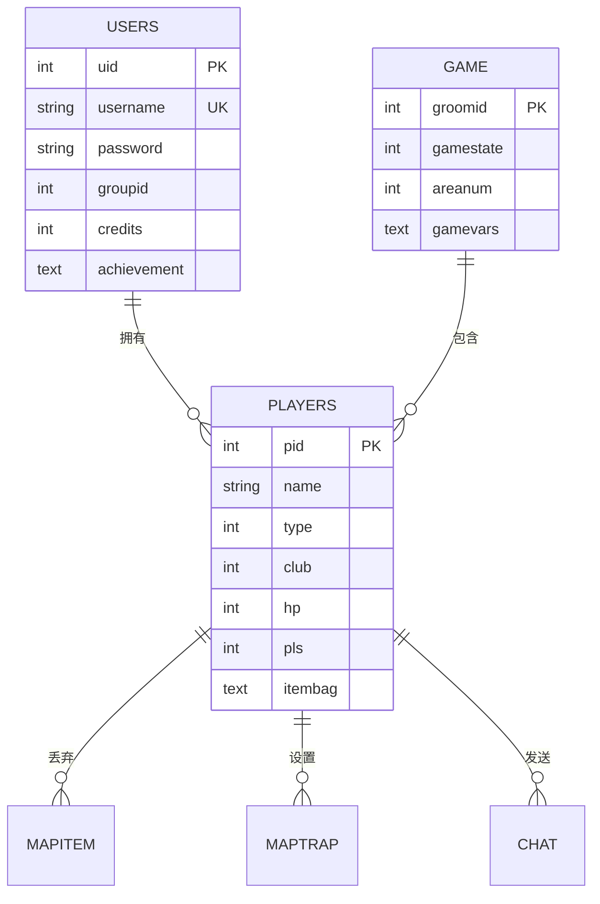

# PHPDTS 数据库设计文档

## 数据库概述

PHPDTS 使用 MySQL 数据库存储游戏数据，采用表前缀机制支持多实例部署。数据库设计遵循第三范式，确保数据一致性和完整性。

## 表前缀说明

- `{tablepre}` - 游戏房间数据表前缀（如：bra_）- 存储单局游戏数据
- `{gtablepre}` - 全局数据表前缀（如：acbra2_）- 存储跨局持久数据

## 核心数据表

### 1. 用户系统表

#### users 表 - 用户账户信息
```sql
CREATE TABLE {gtablepre}users (
  uid mediumint(8) unsigned NOT NULL AUTO_INCREMENT,
  username char(15) NOT NULL DEFAULT '',
  password char(32) NOT NULL DEFAULT '',
  groupid tinyint(3) unsigned NOT NULL DEFAULT '0',
  roomid tinyint(3) unsigned NOT NULL DEFAULT '0',
  lastgame smallint(5) unsigned NOT NULL DEFAULT '0',
  ip char(15) NOT NULL DEFAULT '',
  credits int(10) NOT NULL DEFAULT '0',
  credits2 mediumint(9) NOT NULL DEFAULT '0',
  achievement text NOT NULL,
  achrev text NOT NULL,
  daily varchar(255) NOT NULL DEFAULT '',
  nick text NOT NULL,
  nicks text NOT NULL,
  PRIMARY KEY (uid),
  UNIQUE KEY username (username)
);
```

**字段说明：**
- `uid` - 用户唯一ID
- `username` - 用户名
- `password` - MD5加密密码
- `groupid` - 用户组ID（权限等级）
- `roomid` - 当前房间ID
- `credits` - 游戏币
- `credits2` - 切糕（高级货币）
- `achievement` - 成就数据（JSON）
- `daily` - 每日任务数据

### 2. 游戏角色表

#### players 表 - 游戏内角色数据
```sql
CREATE TABLE {tablepre}players (
  pid smallint unsigned NOT NULL auto_increment,
  type tinyint NOT NULL default '0',
  name char(40) not null default '',
  pass char(32) NOT NULL default '',
  ip char(15) NOT NULL DEFAULT '',
  gd char(1) NOT NULL default 'm',
  race char(32) NOT NULL default '0',
  club tinyint unsigned NOT NULL default '0',
  hp int(10) unsigned NOT NULL DEFAULT '0',
  mhp int(10) unsigned NOT NULL DEFAULT '0',
  sp int(10) unsigned NOT NULL DEFAULT '0',
  msp int(10) unsigned NOT NULL DEFAULT '0',
  att int(10) unsigned NOT NULL DEFAULT '0',
  def int(10) unsigned NOT NULL DEFAULT '0',
  pgroup tinyint unsigned NOT NULL DEFAULT '0',
  pls tinyint unsigned NOT NULL default '0',
  lvl tinyint unsigned NOT NULL default '0',
  exp smallint unsigned NOT NULL default '0',
  money int(10) unsigned NOT NULL DEFAULT '0',
  rp int(10) NOT NULL DEFAULT '0',
  inf char(10) not null default '',
  rage tinyint unsigned NOT NULL default '0',
  pose tinyint(1) unsigned NOT NULL default '0',
  tactic tinyint(1) unsigned NOT NULL default '0',
  state tinyint unsigned NOT NULL default '0',
  clbpara text NOT NULL,
  PRIMARY KEY (pid),
  KEY name (name),
  KEY type (type),
  KEY pls (pls)
);
```

**关键字段：**
- `pid` - 角色ID
- `type` - 角色类型（0=玩家，92=种火NPC，其他=各种NPC）
- `club` - 所属社团（22=枫火歌者）
- `hp/mhp` - 当前/最大生命值
- `sp/msp` - 当前/最大体力值
- `att/def` - 攻击力/防御力
- `pgroup` - 地图组（0=标准地图，其他=隐藏地图组）
- `pls` - 当前位置
- `rp` - 声望值
- `inf` - 受伤状态（h=头部，b=身体，a=手腕，f=足部，p=中毒，u=烧伤，i=冻结，e=麻痹）
- `pose` - 姿态（影响战斗）
- `tactic` - 战术（影响战斗）
- `state` - 角色状态（0=正常，1=休息，2=治疗，3=静养等）
- `clbpara` - 扩展参数（JSON格式，存储技能、种火、对话等数据）

### 3. 游戏状态表

#### game 表 - 游戏全局状态
```sql
CREATE TABLE {gtablepre}game (
  groomid tinyint(3) unsigned NOT NULL DEFAULT '0',
  gamenum smallint(5) unsigned NOT NULL DEFAULT '0',
  gamestate tinyint(3) unsigned NOT NULL DEFAULT '0',
  lastupdate int(10) unsigned NOT NULL DEFAULT '0',
  starttime int(10) unsigned NOT NULL DEFAULT '0',
  winmode tinyint(3) unsigned NOT NULL DEFAULT '0',
  winner varchar(255) NOT NULL DEFAULT '',
  arealist varchar(255) NOT NULL DEFAULT '',
  areanum tinyint(3) unsigned NOT NULL DEFAULT '0',
  validnum smallint(5) unsigned NOT NULL DEFAULT '0',
  alivenum smallint(5) unsigned NOT NULL DEFAULT '0',
  deathnum smallint(5) unsigned NOT NULL DEFAULT '0',
  weather tinyint(3) unsigned NOT NULL DEFAULT '0',
  gamevars text NOT NULL,
  PRIMARY KEY (groomid)
);
```

**状态字段：**
- `gamestate` - 游戏状态（0=结束，20=进行中等）
- `arealist` - 禁区列表
- `validnum/alivenum/deathnum` - 参与/存活/死亡人数
- `weather` - 当前天气
- `gamevars` - 游戏变量（JSON格式）

### 4. 物品系统表

#### 物品相关字段（在players表中）
```sql
-- 主武器系统
wep char(30) NOT NULL default '',      -- 武器名称
wepk char(40) not null default '',     -- 武器类型
wepe int(10) unsigned NOT NULL DEFAULT '0',  -- 武器耐久
weps char(10) not null default '0',    -- 武器数值属性
wepsk char(40) not null default '',    -- 武器特殊属性
weppara text not null,                 -- 武器参数（JSON）

-- 副武器系统
wep2 char(30) NOT NULL default '',     -- 副武器名称
wep2k char(40) not null default '',    -- 副武器类型
wep2e int(10) unsigned NOT NULL DEFAULT '0', -- 副武器耐久
wep2s char(10) not null default '0',   -- 副武器数值属性
wep2sk char(40) not null default '',   -- 副武器特殊属性
wep2para text not null,                -- 副武器参数（JSON）

-- 防具系统
arb char(30) NOT NULL default '',      -- 防具名称
arbk char(40) not null default '',     -- 防具类型
arbe int(10) unsigned NOT NULL DEFAULT '0',  -- 防具耐久
arbs char(10) not null default '0',    -- 防具数值属性
arbsk char(40) not null default '',    -- 防具特殊属性
arbpara text not null,                 -- 防具参数（JSON）

-- 背包系统
itembag text NOT NULL default '',      -- 背包物品（JSON格式）
itmnum smallint unsigned NOT NULL default '0',  -- 当前物品数量
itmnumlimit smallint unsigned NOT NULL default '0',  -- 背包容量上限
```

### 5. 地图系统表

#### mapitem 表 - 地图物品
```sql
CREATE TABLE {tablepre}mapitem (
  iid int(10) unsigned NOT NULL auto_increment,
  pls tinyint(3) unsigned NOT NULL default '0',
  itmk char(40) not null default '',
  itme int(10) unsigned NOT NULL DEFAULT '0',
  itms char(10) not null default '0',
  itmsk char(40) not null default '',
  itmnum smallint(5) unsigned NOT NULL default '1',
  findtime int(10) unsigned NOT NULL default '0',
  PRIMARY KEY (iid),
  KEY pls (pls)
);
```

#### maptrap 表 - 地图陷阱
```sql
CREATE TABLE {tablepre}maptrap (
  tid int(10) unsigned NOT NULL auto_increment,
  pls tinyint(3) unsigned NOT NULL default '0',
  type tinyint(3) unsigned NOT NULL default '0',
  damage smallint(5) unsigned NOT NULL default '0',
  rate tinyint(3) unsigned NOT NULL default '0',
  maxhp smallint(5) unsigned NOT NULL default '0',
  PRIMARY KEY (tid),
  KEY pls (pls)
);
```

### 6. 通信系统表

#### chat 表 - 聊天记录
```sql
CREATE TABLE {tablepre}chat (
  cid int(10) unsigned NOT NULL auto_increment,
  type tinyint(3) unsigned NOT NULL default '0',
  name char(40) not null default '',
  content text NOT NULL,
  chattime int(10) unsigned NOT NULL default '0',
  PRIMARY KEY (cid),
  KEY chattime (chattime),
  KEY type (type)
);
```

## 数据关系图



## 索引设计

### 主要索引
- `players.name` - 按角色名查询
- `players.type` - 按角色类型查询
- `players.pls` - 按位置查询
- `mapitem.pls` - 按地图位置查询
- `chat.chattime` - 按时间查询聊天记录

### 复合索引
- `players(type, pls)` - 查询特定位置的特定类型角色
- `chat(type, chattime)` - 查询特定类型的聊天记录

## 数据完整性

### 外键约束
由于性能考虑，系统主要通过应用层保证数据一致性，较少使用数据库外键。

### 数据验证
- 用户名唯一性检查
- 数值范围验证
- JSON格式验证

## 性能优化

### 查询优化
1. **分页查询** - 使用LIMIT减少数据传输
2. **条件索引** - 为常用查询条件建立索引
3. **查询缓存** - 缓存频繁查询的结果

### 存储优化
1. **数据类型选择** - 使用合适的数据类型节省空间
2. **JSON存储** - 复杂数据使用JSON格式存储
3. **数据压缩** - 大文本字段考虑压缩存储

## 备份策略

### 备份方案
1. **全量备份** - 每日凌晨进行全量备份
2. **增量备份** - 每小时进行增量备份
3. **实时同步** - 关键数据实时同步到从库

### 恢复策略
1. **点对点恢复** - 支持恢复到任意时间点
2. **表级恢复** - 支持单表数据恢复
3. **灾难恢复** - 异地备份保证数据安全

---

*本文档详细描述了PHPDTS的数据库设计，为数据管理和优化提供参考。*
