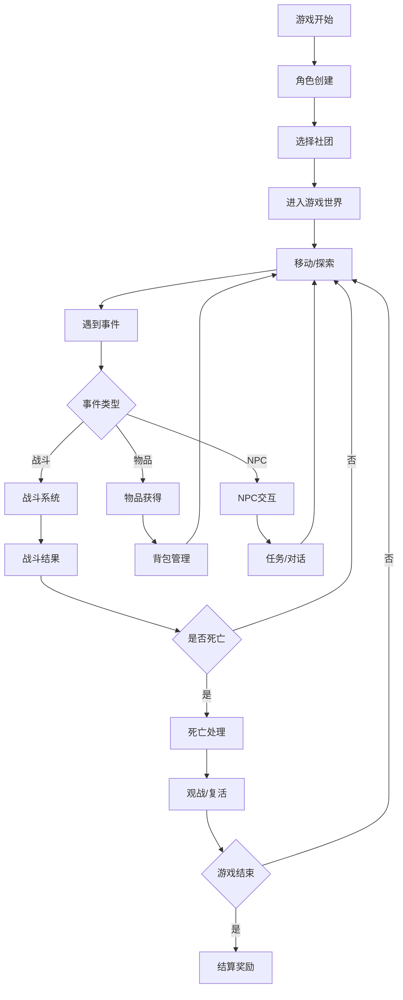
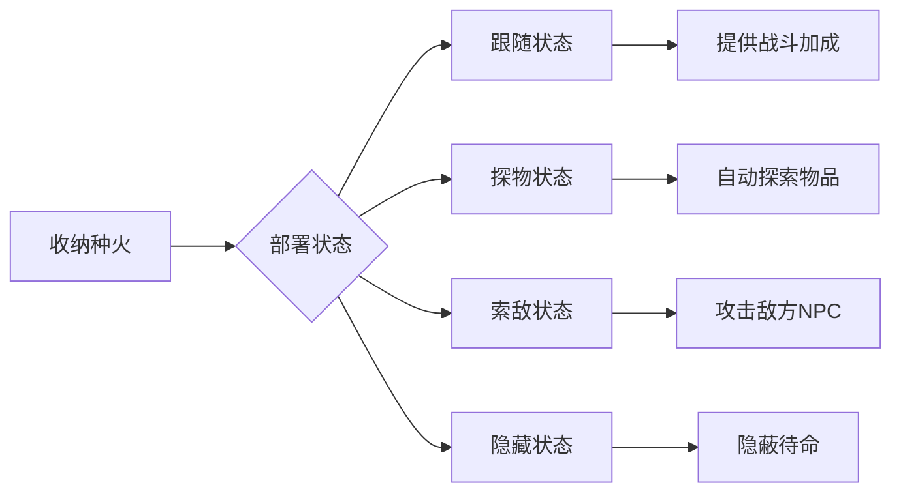
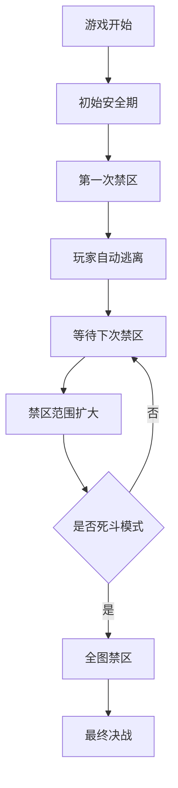
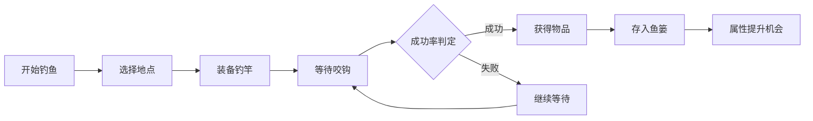

# PHPDTS 游戏机制详解

## 游戏概述

PHPDTS 是一个多人在线生存竞技游戏，玩家在有限的地图上进行探索、战斗，最终目标是成为最后的生存者。游戏采用回合制机制，结合实时元素，提供丰富的策略性和趣味性。

## 核心游戏循环



## 角色系统

### 基础属性
- **生命值 (HP)**: 角色的生存能力，降至0时死亡
- **体力值 (SP)**: 执行动作的消耗，影响移动和战斗
- **攻击力 (ATT)**: 影响造成的伤害
- **防御力 (DEF)**: 减少受到的伤害
- **等级 (LVL)**: 通过经验值提升，影响基础属性

### 状态系统
- **正常状态**: 无特殊影响
- **受伤状态**: 
  - 头部受伤 (h): 影响命中率
  - 身体受伤 (b): 影响防御力
  - 手腕受伤 (a): 影响探索消耗
  - 足部受伤 (f): 影响移动消耗
- **异常状态**:
  - 中毒 (p): 持续扣血
  - 烧伤 (u): 移动时额外扣血
  - 冻结 (i): 增加行动消耗
  - 麻痹 (e): 降低行动效率

## 社团系统

### 社团类型
1. **街头霸王 (Club 1)**: 近战格斗专精
2. **见敌必斩 (Club 2)**: 攻击力强化
3. **灌篮高手 (Club 3)**: 体能型社团
4. **狙击鹰眼 (Club 4)**: 远程精准射击
5. **拆弹专家 (Club 5)**: 爆炸物处理
6. **宛如疾风 (Club 6)**: 速度和敏捷
7. **锡安成员 (Club 7)**: 防御专精
8. **黑衣组织 (Club 8)**: 暗杀和潜行
9. **超能力者 (Club 9)**: 特殊能力
10. **天赋异禀 (Club 10)**: 成长加速
11. **富家子弟 (Club 11)**: 资源优势
12. **全能兄贵 (Club 12)**: 全面发展
13. **铁拳无敌 (Club 13)**: 徒手战斗
15. **L5状态 (Club 15)**: 特殊状态
17. **走路萌物 (Club 17)**: 特殊机制
19. **晶莹剔透 (Club 19)**: 防护能力
20. **元素大师 (Club 20)**: 元素操控
21. **码语行人 (Club 21)**: 信息处理
22. **枫火歌者 (Club 22)**: 种火收纳系统

### 社团技能
每个社团都有独特的技能树：
- **被动技能**: 自动生效的能力
- **主动技能**: 需要消耗资源使用
- **终极技能**: 高级技能，效果强大

### 种火系统 (Club 22 专属)


## 战斗系统

### 战斗流程
1. **遭遇阶段**: 确定战斗双方
2. **准备阶段**: 选择武器和战术
3. **攻击阶段**: 计算伤害和命中
4. **反击阶段**: 防守方反击机会
5. **结算阶段**: 确定战斗结果

### 伤害计算
```
基础伤害 = (攻击力 - 防御力) × 武器系数
最终伤害 = 基础伤害 × 姿态系数 × 战术系数 × 随机系数
```

### 特殊战斗机制
- **暴击系统**: 低概率造成额外伤害
- **格挡系统**: 减少受到的伤害
- **连击系统**: 连续攻击获得加成
- **反击系统**: 被攻击时的反击机会

### 核武器系统
- **范围伤害**: 影响同一位置的所有玩家
- **特殊防护**: 种火技能可以减免核武器伤害
- **使用限制**: 需要特殊物品和条件

## 物品系统

### 物品分类
- **武器类**:
  - WP=钝器, WK=锐器, WG=远程兵器, WF=投掷兵器, WC=爆炸物, WD=电子兵器, WB=灵力兵器
- **防具类 (D)**: 提供防御力和保护
- **恢复类**:
  - HH=生命恢复, HS=体力恢复, HB=综合恢复, HP=特殊恢复
- **药剂类**:
  - C开头=各种治疗药剂, PS=精神制剂
- **工具类**:
  - Y=一般工具, Z=特殊工具, X=特殊物品
- **弹药类**:
  - GB=子弹, GBe=能量弹药, 其他G开头=各种弹药
- **材料类 (A)**: 合成和强化材料
- **种火类 (🎆)**: 枫火歌者专用，H=篝火, V=埋火, O=永火, D=残火

### 物品属性
- **耐久度**: 使用次数限制
- **特殊属性**: 额外效果和能力
- **品质等级**: 影响物品效果
- **参数系统**: JSON格式的扩展属性

### 背包系统
- **容量限制**: 根据等级和装备确定
- **分类管理**: 按类型自动分类
- **快捷使用**: 支持快捷键操作

## 地图系统

### 地图结构
- **标准地图**: 50个基础位置（0-49），所有玩家默认可访问
- **隐藏地图**: 通过pgroup字段区分的特殊地图组
  - 地图组1: 测试地图1A-3A (101-103)
  - 地图组2: 测试地图1B-4B (111-114)
- **特殊地点**:
  - 0号地点: 介绍区域
  - 33号地点: 特殊BGM区域
  - 34号地点: 英灵殿
  - 254号地点: 尸体销毁区域
- **禁区机制**: 定时封锁区域，强制玩家移动

### 移动机制
- **体力消耗**: 移动需要消耗SP
- **冷却时间**: 防止频繁移动
- **特殊地形**: 不同地形有不同效果

### 禁区系统


## 探索系统

### 探索机制
- **随机事件**: 探索时触发各种事件
- **物品发现**: 找到地图上的物品
- **NPC遭遇**: 遇到友善或敌对NPC
- **陷阱触发**: 踩到其他玩家设置的陷阱

### 视野系统
- **探索记忆**: 记住最近探索的内容
- **视野范围**: 限制可见信息数量
- **信息更新**: 实时更新周围情况

## 钓鱼系统

### 钓鱼地点
- **雪之镇 (3)**: 海鱼和基础物品
- **清水池 (7)**: 淡水鱼和药剂
- **夏之镇 (12)**: 热带鱼和装备
- **索拉利斯 (4)**: 外星物品和高科技
- **永恒的世界 (24)**: 奇幻物品和稀有材料

### 钓鱼机制


### 钓竿效果
- **提高成功率**: 装备钓竿增加钓鱼成功率
- **稀有物品**: 更容易钓到稀有物品
- **属性加成**: 钓鱼时有机会提升基础属性

## 对话系统

### 对话机制
- **NPC对话**: 与游戏角色的交互
- **选择分支**: 影响剧情发展的选择
- **条件触发**: 满足特定条件才能触发
- **奖励获得**: 完成对话获得奖励

### 对话类型
- **剧情对话**: 推进游戏故事
- **任务对话**: 接受和完成任务
- **商店对话**: 购买和出售物品
- **信息对话**: 获取游戏提示

## 成就系统

### 成就分类
- **战斗成就**: 击杀数量、连胜记录
- **探索成就**: 发现物品、访问地点
- **收集成就**: 收集特定物品或装备
- **社交成就**: 团队合作、聊天互动
- **特殊成就**: 隐藏条件的特殊成就

### 奖励机制
- **经验奖励**: 获得额外经验值
- **物品奖励**: 获得特殊物品
- **称号奖励**: 获得特殊称号
- **积分奖励**: 获得游戏积分

## 平衡性设计

### 数值平衡
- **属性上限**: 防止数值无限增长
- **冷却机制**: 限制操作频率
- **资源消耗**: 平衡风险与收益

### 策略平衡
- **多样化路线**: 支持不同的游戏策略
- **相互制衡**: 不同策略相互制约
- **运气因素**: 适度的随机性增加变数

---

*本文档详细介绍了PHPDTS的各项游戏机制，为玩家和开发者提供全面的参考。*
