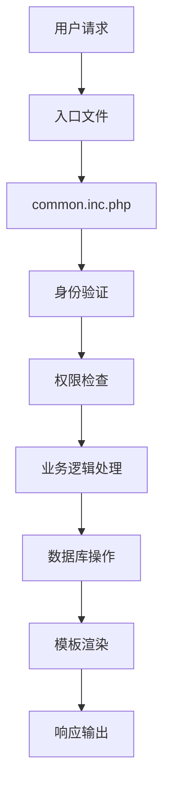
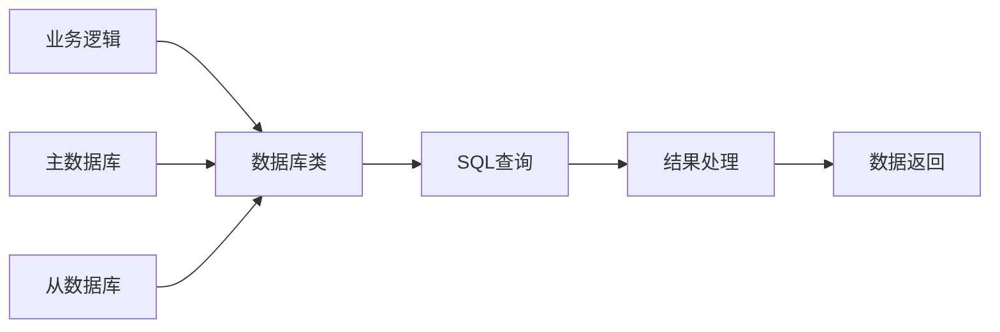

# PHPDTS 系统架构文档

## 整体架构

PHPDTS 采用经典的 MVC 架构模式，结合模块化设计，确保系统的可维护性和扩展性。

## 核心组件

### 1. 前端控制器

#### 主要入口文件
- `index.php` - 首页和登录
- `game.php` - 游戏主界面
- `admin.php` - 管理员界面
- `user.php` - 用户管理
- `api.php` - API接口

#### 请求处理流程
```
用户请求 → 入口文件 → 公共初始化 → 业务逻辑 → 模板渲染 → 响应输出
```

### 2. 数据访问层

#### 数据库抽象
- `include/db_mysqli.class.php` - MySQLi数据库类（主要使用）
- 支持字符集设置和SQL模式配置
- 内置查询日志和错误处理机制

#### 数据库连接管理
```php
// 数据库连接初始化
$db = new dbstuff();
$db->connect($dbhost, $dbuser, $dbpw, $dbname);

// 主从数据库支持（通过slave_level配置）
// slave_level: 0=主数据库, 1-3=从数据库级别, -1=反向迁移
```

### 3. 业务逻辑层

#### 核心功能模块

**游戏逻辑** (`include/game/`)
- `battle.func.php` - 战斗遭遇系统
- `combat.func.php` - 战斗核心逻辑
- `revcombat.func.php` - 改进版战斗系统
- `search.func.php` - 移动探索系统
- `item.*.php` - 物品系统模块

**用户管理** (`include/`)
- `user.func.php` - 用户功能
- `state.func.php` - 状态管理
- `masterslave.func.php` - 主从同步

**系统功能**
- `system.func.php` - 系统管理
- `global.func.php` - 全局函数
- `init.func.php` - 初始化函数

### 4. 表现层

#### 模板系统
```php
// 模板加载机制
function template($tplname) {
    return GAME_ROOT."./templates/{$templateid}/{$tplname}.htm";
}
```

#### 模板文件结构
- `templates/default/` - 默认模板
- 支持多模板切换
- 模板变量自动提取

### 5. 配置管理

#### 配置文件层次
```
config.inc.php (主配置)
├── gamedata/system.php (系统配置)
├── gamedata/admincfg.php (管理员配置)
├── gamedata/cache/gamecfg_1.php (游戏规则配置)
├── gamedata/cache/resources_1.php (资源定义配置)
├── gamedata/cache/combatcfg_1.php (战斗系统配置)
├── gamedata/cache/clubskills_1.php (社团技能配置)
├── gamedata/cache/club22cfg.php (枫火歌者社团配置)
├── gamedata/cache/fishing.php (钓鱼系统配置)
├── gamedata/cache/audio_1.php (音频配置)
├── gamedata/cache/dialogue_1.php (对话系统配置)
└── gamedata/cache/tooltip_1.php (提示框配置)
```

#### 配置加载机制
```php
// 动态配置加载
function config($name, $gamecfg) {
    return GAME_ROOT."./gamedata/cache/{$name}_{$gamecfg}.php";
}

// 在common.inc.php中统一加载
require config('resources',$gamecfg);
require config('gamecfg',$gamecfg);
require config('combatcfg',$gamecfg);
require config('clubskills',$gamecfg);
```

## 数据流架构

### 1. 请求处理流程



### 2. 数据库交互



### 3. 缓存机制

#### 文件缓存
- 配置文件缓存 (`gamedata/cache/`)
- 模板编译缓存
- 静态数据缓存

#### 内存缓存
- 全局变量缓存
- 会话数据缓存

## 安全架构

### 1. 输入验证
```php
// 统一输入过滤
function addslashes_deep($value) {
    return is_array($value) ? 
        array_map('addslashes_deep', $value) : 
        addslashes($value);
}
```

### 2. 权限控制
```php
// 管理员权限检查
if($mygroup >= $admin_cmd_list[$command]) {
    // 允许执行
} else {
    // 拒绝访问
}
```

### 3. SQL注入防护
- 使用预处理语句
- 参数绑定
- 输入转义

### 4. XSS防护
- 输出转义
- HTML过滤
- CSP策略

## 性能优化

### 1. 数据库优化
- 索引优化
- 查询优化
- 连接池管理

### 2. 缓存策略
- 配置文件缓存
- 查询结果缓存
- 静态资源缓存

### 3. 代码优化
- 延迟加载
- 条件包含
- 内存管理

## 扩展性设计

### 1. 模块化架构
- 功能模块独立
- 接口标准化
- 插件机制

### 2. 配置驱动
- 参数化配置
- 动态加载
- 热更新支持

### 3. 数据库扩展
- 主从分离
- 读写分离
- 分库分表支持

## 监控与日志

### 1. 错误处理
```php
// 统一错误处理
function gexit($message, $file, $line) {
    // 记录错误日志
    // 显示错误页面
}
```

### 2. 操作日志
- 管理员操作日志
- 用户行为日志
- 系统运行日志

### 3. 性能监控
- 响应时间监控
- 数据库性能监控
- 资源使用监控

## 部署架构

### 1. 单机部署
```
Web服务器 + PHP + MySQL
```

### 2. 分布式部署
```
负载均衡器 → Web服务器集群 → 数据库集群
```

### 3. 容器化部署
- Docker支持
- Kubernetes编排
- 微服务架构

---

*本文档描述了PHPDTS的核心架构设计，为开发和维护提供技术指导。*
